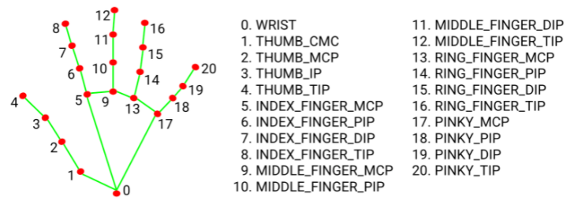

# Detector de Manos 👀

El presente proyecto se basa en el ejercicio realizado en la pagina:
https://programacionpython80889555.wordpress.com/2021/06/22/detector-de-manos-en-python-con-opencv-y-mediapipe/

Donde se realiza un detector de manos, siguiendo como referencia la siguiente imagen de los puntos que detecta el algoritmo:

Las librerias que implementa el proyecto son OpenCV y MediaPipe

~~~
#Instalar librerias
pip install opencv-python
pip install mediapipe
pip install msvc-runtime
~~~

Dentro del codigo se importan los recursos necesarios para su ejecución

~~~
import cv2
import mediapipe as mp
~~~
